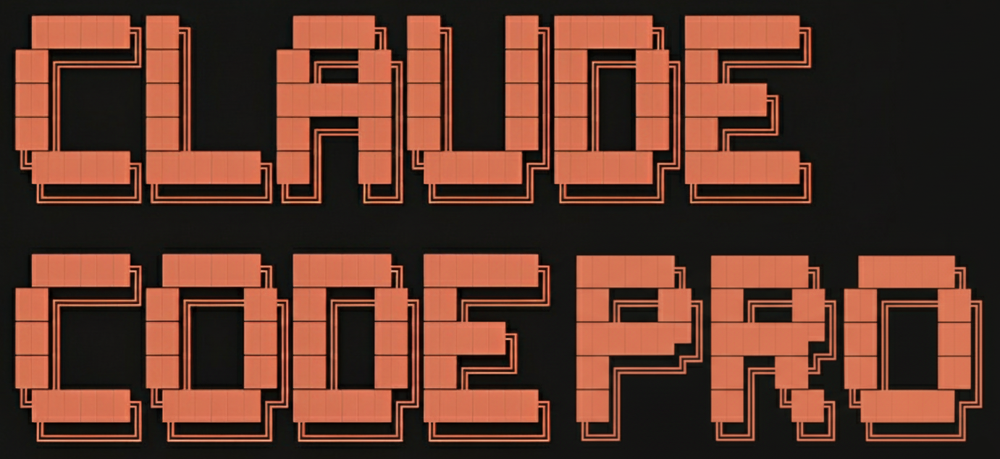

### 🎯 Production-Grade Framework for Professional Developers 🎯

**Transforms Claude Code from a junior assistant into a senior software engineer.**

**Stop "vibing" code, start shipping systematically with Spec-Driven Development & TDD.**

---

## 🎬 Video Masterclass

**This repository is the complete production setup from our 12-module video masterclass:**

#### [→ Enroll Now at Claude-Code.Dev](https://claude-code.dev)

**What you'll learn:**
- 🐳 Automated dev container setup with Docker/OrbStack
- 🎨 Professional IDE configuration
- ⌨️ Optimal terminal experience with voice input
- 🔍 Semantic code search with vector databases
- 🔌 MCP integration with context-optimization techniques
- 🧠 Cross-session memory layer that scales with your codebase
- ✅ Built-in quality control with hooks and CLI tools
- 📋 Optimized Spec-driven workflow (design → plan → implement)
- 🧪 Test-driven development enforcement
- 🚀 Applying all techniques to a production-grade project

---

## ⚡ What's Inside

**Claude Code Pro is token-optimized and built using latest techniques such as the new Skills feature:**

### 🎨 19 Skills (Auto-Enforce Best Practices)
- **6 Testing Skills** - TDD, test writing, anti-patterns, debugging, verification, code review
- **5 Global Skills** - Coding style, commenting, conventions, error handling, validation
- **4 Backend Skills** - API design, models, queries, migrations
- **4 Frontend Skills** - Components, CSS, accessibility, responsive design

### 🔌 8 MCP Servers (Context & Capabilities)
- **Cipher** - Cross-session memory
- **Claude Context** - Semantic codebase search
- **Context7 + Ref** - Up-to-date library documentation
- **IDE Diagnostics** - Real-time error detection
- **Database (dbhub)** - PostgreSQL integration
- **FireCrawl** - Web scraping and search
- **Playwright** - Browser automation
- **MCP Funnel** - Tool filtering for token optimization

### 🛠️ 3 Testing Tools
- **pytest** - Unit and integration testing with uv
- **Newman** - API end-to-end testing with Postman collections
- **Qlty** - Automated code quality hooks

### 📋 3 Slash Commands (Spec-Driven Workflow)
- `/spec-design` - Brainstorm → Design document
- `/spec-plan` - Design → Implementation plan
- `/spec-implement` - Plan → Production-grade code

### 🐳 Automated Dev Container Setup
- **9 DevContainer Features** - Zsh, Node.js, Docker-in-Docker, uv, ruff, mypy, git, fzf, desktop
- **27 VS Code Extensions** - Python, Docker, SQL, testing, formatting, and development tools
- **7 CLI Tools** - qlty, Claude Code, Statusline, dotenvx, Cipher, Newman, Playwright
- **PostgreSQL Database** - Local instance on port 5433 for development and testing

---

## 🚀 Installation

### Prerequisites

- **[Docker Desktop](https://www.docker.com/products/docker-desktop/)** or **[OrbStack](https://orbstack.dev/download)**
- **[VS Code Stable](https://code.visualstudio.com/)** or **[Cursor](https://cursor.com/)**
- **[Dev Containers Extension](https://marketplace.visualstudio.com/items?itemName=ms-vscode-remote.remote-containers)**

### Setup

- Clone this repository and install the prerequisites from above
- Open folder in VS Code, click on the button on the bottom-left: `Reopen in Container`
- Wait for automatic build to finish, this can take a couple of minutes
- Copy `.env.example` to `.env` and add your credentials and API keys
- In the Command Palette, run `Developer: Reload Window` to apply all settings
- In the launched terminal, always allow dotenv (a), then run `cc` and finish the setup
- Run `/config` to set auto-connect to IDE to true, then run `/ide` to connect to VS Code diagnostics
- You can click "OPEN CC" in the lower bar to start a split terminal and monitor usage with `/usage`
- Start coding with Claude Code Pro and watch the Masterclass to learn more advanced techniques!

---

## 🤝 Contributing

Contributions welcome: custom skills, MCP integrations, workflow improvements, bug reports.

---

## 🙏 Acknowledgments

**Tools:**
- **[campfirein/cipher](https://github.com/campfirein/cipher)** - CC Cross-session memory
- **[zilliztech/claude-context](https://github.com/zilliztech/claude-context)** - CC Semantic code search
- **[hagan/claudia-statusline](https://github.com/hagan/claudia-statusline)** - CC Status line integration
- **[chris-schra/mcp-funnel](https://github.com/chris-schra/mcp-funnel)** - CC MCP tool filtering
- **[astral-sh/uv](https://github.com/astral-sh/uv)** - Fast Python package manager
- **[astral-sh/ruff](https://github.com/astral-sh/ruff)** - Fast Python linter and formatter
- **[qltysh/qlty](https://github.com/qltysh/qlty)** - Code quality automation
- **[dotenvx/dotenvx](https://github.com/dotenvx/dotenvx)** - Environment variable management
- **[postman/newman](https://github.com/postman/newman)** - End-to-End API testing

**MCP Servers:**
- **[upstash/context7](https://github.com/upstash/context7)** - Library documentation
- **[ref-tools/ref-tools-mcp](https://github.com/ref-tools/ref-tools-mcp)** - Documentation search
- **[mendableai/firecrawl](https://github.com/mendableai/firecrawl)** - Web scraping
- **[bytebase/dbhub](https://github.com/bytebase/dbhub)** - Database connectivity
- **[microsoft/playwright-mcp](https://github.com/microsoft/playwright-mcp)** - Browser automation
- **[chris-schra/mcp-funnel](https://github.com/chris-schra/mcp-funnel)** - Tool filtering

**Inspiration:**
- **[buildermethods/agent-os](https://github.com/buildermethods/agent-os)** - For Spec-driven workflow
- **[obra/superpowers](https://github.com/obra/superpowers)** - For Spec-driven skills

---

**⭐ Star this repo if it helps you ship better code!**

Made with ❤️ by [Max Ritter](https://www.maxritter.net)

[🌐 claude-code.pro](https://www.claude-code.pro)

